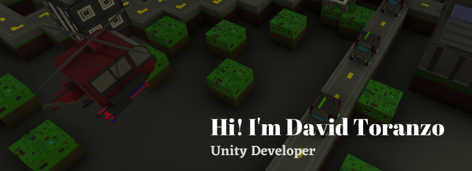

I'm Unity developer and computer science student. I love the video games, I learned by myself and in 2022 I started working in a professional team. I consider myself a lover of clean code and sports. In my free time I made games and participe in jams, currently learning about AR.

<footer>
        

            

                
Page responsive

                
This page was made by David Toranzo - 2021

            

            

                <ul class="social-links">
                    <li><a href="https://www.linkedin.com/in/davidtoranzo/" target="_blank"><i class="fab fa-linkedin" style="font-size: 1.5em;" aria-hidden="true"></i></a></li>
                    <li><a href="https://www.instagram.com/davidmauriciotoranzo/" target="_blank"><i class="fab fa-instagram" style="font-size:1.5em;" aria-hidden="true"></i></a></li>
                    <li><a href="https://david-toranzo.itch.io/" target="_blank"><i class="fab fa-itch-io" style="font-size: 1.5em;" aria-hidden="true"></i></a></li>
                    <li><a href="https://github.com/david444456" target="_blank"><i class="fab fa-github" style="font-size: 1.5em;" aria-hidden="true"></i></a></li>
                </ul>
            

        

    </footer>
<!--
**david-toranzo/david-toranzo** is a ✨ _special_ ✨ repository because its `README.md` (this file) appears on your GitHub profile.

Here are some ideas to get you started:

- 🔭 I’m currently working on ...
- 🌱 I’m currently learning ...
- 👯 I’m looking to collaborate on ...
- 🤔 I’m looking for help with ...
- 💬 Ask me about ...
- 📫 How to reach me: ...
- 😄 Pronouns: ...
- ⚡ Fun fact: ...
-->
